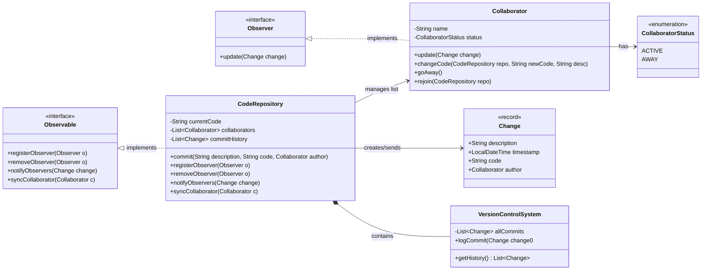

```mermaid
classDiagram
    direction LR

    class Observable {
        <<interface>>
        +registerObserver(Observer o)
        +removeObserver(Observer o)
        +notifyObservers(Change change)
        +syncCollaborator(Collaborator c)
    }

    class Observer {
        <<interface>>
        +update(Change change)
    }

    class CodeRepository {
        -String currentCode
        -List~Collaborator~ collaborators
        -List~Change~ commitHistory
        +commit(String description, String code, Collaborator author)
        +registerObserver(Observer o)
        +removeObserver(Observer o)
        +notifyObservers(Change change)
        +syncCollaborator(Collaborator c)
    }

    class Collaborator {
        -String name
        -CollaboratorStatus status
        +update(Change change)
        +changeCode(CodeRepository repo, String newCode, String desc)
        +goAway()
        +rejoin(CodeRepository repo)
    }

    class Change {
        <<record>>
        +String description
        +LocalDateTime timestamp
        +String code
        +Collaborator author
    }

    class VersionControlSystem {
        -List~Change~ allCommits
        +logCommit(Change change0
        +getHistory() List~Change~
    }

    class CollaboratorStatus {
        <<enumeration>>
        ACTIVE
        AWAY
    }

    Observable <|.. CodeRepository : implements
    Observer <|.. Collaborator : implements
    CodeRepository --> Collaborator : manages list
    CodeRepository --> Change : creates/sends
    CodeRepository *-- VersionControlSystem : contains
    Collaborator --> CollaboratorStatus : has
```
